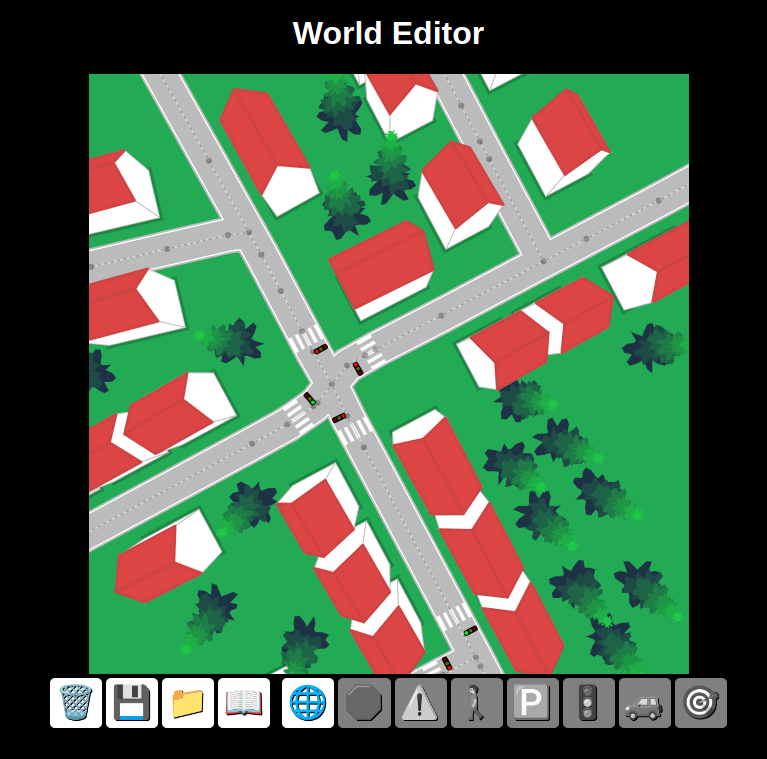
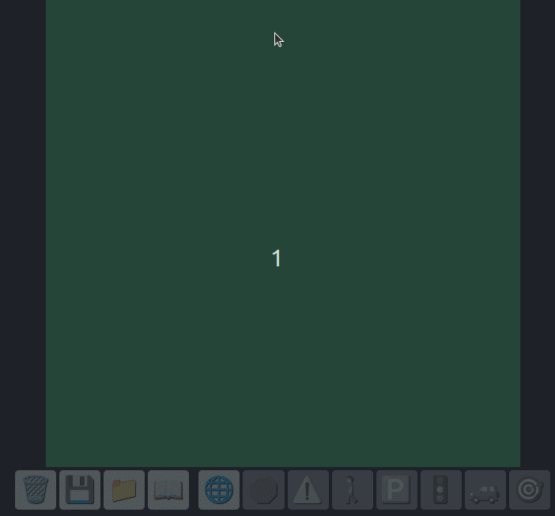

## Virtual World for Self-Driving Car project

Virtual World built using JavaScript as a learning project about Neural Network.

In this project I built a Virtual World featuring:
- World Editor;
- Roads;
- Markings like crossings, STOP, lights and so on;
- Auto generated trees;
- Auto generated buildings;
- OpenStreetMap integration for real world data ( small part of Manchester City in the screenshots);
- Self-driving car integration (from previous project);
- Minimap feature;

## This project was done following along [Radu](https://www.youtube.com/@Radu)'s course Self-Driving car Phase 2. Big appreciation to Radu for sharing his knowledge in a fun, interactive and easy way to follow along.